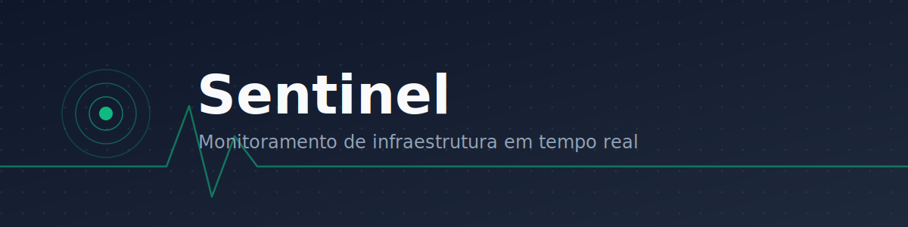

<p align="center">
  
</p>

<p align="center">
  <a href="https://github.com/arthurrc02/sentinel-monitor/actions/workflows/ci.yml"></a>
  <a href="LICENSE"></a>
  
  
  
</p>

Sentinel é uma plataforma de monitoramento de infraestrutura: um agente coleta métricas de máquinas, uma API centraliza e persiste esses dados, e um dashboard web exibe tudo em tempo real — com atualização automática, status online/offline e busca.

**Status atual: Release Candidate 1.0.** As três aplicações funcionam de ponta a ponta. Ver [Roadmap](#roadmap) para o histórico completo.

## Tecnologias

| Aplicação | Stack |
|---|---|
| [`agent/`](agent/) | Python 3.11+, [uv](https://docs.astral.sh/uv/), [psutil](https://github.com/giampaolo/psutil), [httpx](https://www.python-httpx.org/), [pydantic-settings](https://docs.pydantic.dev/latest/concepts/pydantic_settings/) |
| [`backend/`](backend/) | Python 3.11+, [FastAPI](https://fastapi.tiangolo.com/), [SQLAlchemy 2](https://www.sqlalchemy.org/), [Alembic](https://alembic.sqlalchemy.org/), [PostgreSQL](https://www.postgresql.org/), uv |
| [`frontend/`](frontend/) | [React](https://react.dev/) 18, [Vite](https://vite.dev/), TypeScript, [Tailwind CSS](https://tailwindcss.com/) v4, [TanStack Query](https://tanstack.com/query), React Router |

Qualidade em comum às três: [ruff](https://docs.astral.sh/ruff/) + [mypy](https://mypy-lang.org/) strict (Python), [ESLint](https://eslint.org/) + `tsc` (TypeScript), testes automatizados ([pytest](https://docs.pytest.org/) e [Vitest](https://vitest.dev/)), e [CI](.github/workflows/ci.yml) no GitHub Actions.

## Arquitetura

Monorepo com três aplicações independentes, cada uma com sua própria camada de responsabilidade:

```
Agent (coleta) → Backend (ingestão + regra de negócio) → PostgreSQL → Backend (consulta) → Frontend (visualização)
```

- **Agent**: roda na máquina monitorada, se registra no backend e envia CPU/memória/disco periodicamente (retry com backoff exponencial em falhas).
- **Backend**: FastAPI em camadas (`routers` → `services` → `repositories` → `models`), persistência em PostgreSQL via SQLAlchemy/Alembic, calcula o status online/offline de cada computador na leitura.
- **Frontend**: React consumindo a API via React Query, com polling configurável para atualização automática — sem WebSocket/SSE.

Diagramas completos (visão geral + fluxo interno de cada aplicação, em Mermaid): [`docs/diagrams/`](docs/diagrams/). Detalhes de cada camada: [`docs/architecture.md`](docs/architecture.md).

## Como executar

Requisitos: Python 3.11+ com [uv](https://docs.astral.sh/uv/), Node.js 20+, [Docker](https://www.docker.com/).

Atalho com os scripts prontos (instala tudo e sobe Postgres + backend + frontend):

```bash
./scripts/setup.sh && ./scripts/run-all.sh      # Linux/Mac
.\scripts\setup.ps1; .\scripts\run-all.ps1       # Windows (PowerShell)
```

Ou passo a passo manual:

```bash
# 1. Banco de dados
docker compose up -d postgres

# 2. Backend
cd backend && uv sync && cp .env.example .env
uv run alembic upgrade head
uv run uvicorn app.main:app --reload &

# 3. Frontend
cd ../frontend && npm install && cp .env.example .env
npm run dev &

# 4. Agent (opcional, com o backend já rodando)
cd ../agent && uv sync && cp .env.example .env
uv run sentinel-agent
```

Dashboard em `http://localhost:5173`, API em `http://localhost:8000/docs`. Passo a passo completo, variáveis de ambiente e comandos de lint/teste de cada aplicação: [`docs/setup.md`](docs/setup.md) e o `README.md` de cada pasta.

## Estrutura do projeto

```
Sentinel/
├── agent/                     # coleta métricas e envia ao backend
│   ├── src/sentinel_agent/    # config, collectors, client, services, main
│   └── tests/
├── backend/                   # API REST + persistência
│   ├── app/                   # core, db, models, schemas, repositories, services, routers
│   ├── alembic/                # migrations
│   └── tests/
├── frontend/                   # dashboard web
│   └── src/                   # api, hooks, components, pages, lib
├── docs/                       # documentação (arquitetura, decisões, API, diagramas, banner)
├── scripts/                    # setup.{sh,ps1}, run-all.{sh,ps1}
├── docker-compose.yml          # PostgreSQL de desenvolvimento
└── .github/workflows/ci.yml    # CI
```

Cada aplicação tem seu próprio `README.md` com instruções de instalação e execução.

## Documentação

- [Arquitetura](docs/architecture.md)
- [Roadmap](docs/roadmap.md)
- [API](docs/api.md)
- [Decisões técnicas](docs/decisions.md)
- [Setup](docs/setup.md)
- [Diagramas](docs/diagrams/)

## Qualidade

- **Lint**: ruff (Python, com regras `E`/`F`/`I`/`UP`/`B`/`SIM`) e ESLint (TypeScript, com `jsx-a11y`).
- **Tipagem estática**: mypy em modo strict (agent e backend) e `tsc` (frontend).
- **Testes**: pytest (agent e backend), Vitest + Testing Library (frontend).
- **CI**: [GitHub Actions](.github/workflows/ci.yml) roda lint, testes e typecheck das três aplicações a cada push/PR.

## Screenshots

Ainda não há screenshots publicadas nesta pasta — veja [`docs/screenshots/README.md`](docs/screenshots/README.md) para as instruções de quais telas capturar. Enquanto isso, a interface pode ser vista rodando o projeto localmente (veja [Como executar](#como-executar)).

## Roadmap

| Fase | Descrição | Status |
|---|---|---|
| 0 | Fundação: estrutura dos três apps, uv, Docker Compose, lint/typecheck/testes, CI | Concluída |
| 1 | Backend funcional: SQLAlchemy, Alembic, cadastro de computadores e métricas | Concluída |
| 2 | Dashboard inicial: listagem e detalhe de computadores | Concluída |
| 3 | Sentinel Agent: coleta e envio periódico com retry/backoff | Concluída |
| 4 | Integração: status online/offline, polling, busca/ordenação | Concluída |
| 5 | Release Candidate 1.0: índice no banco, correção de corrida, logging, testes no frontend, README revisado | Concluída |
| 6 | Portfólio: README profissional, diagramas Mermaid, scripts de onboarding, auditoria de organização | Concluída |

Detalhes de cada fase: [`docs/roadmap.md`](docs/roadmap.md).

## Como contribuir

Contribuições são bem-vindas — bugs, testes, documentação e refino de UX existente, em especial. Veja [`CONTRIBUTING.md`](CONTRIBUTING.md) para como rodar o projeto, o checklist antes de abrir um PR e o padrão de commits.

## Licença

Distribuído sob a licença [MIT](LICENSE).
