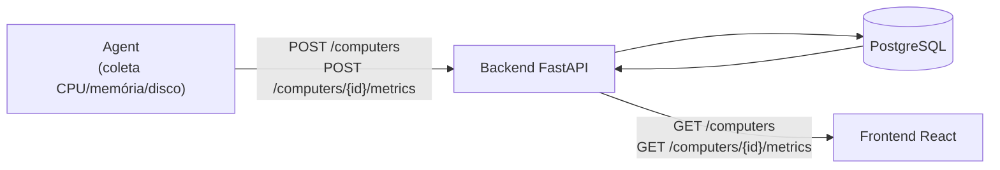

# Fluxo do sistema

Fluxo atual de dados entre as três aplicações do Sentinel.

- **Agent**: se registra uma vez e, a partir daí, só envia métricas (ingestão).
- **Backend**: persiste tudo em PostgreSQL e é a única aplicação que fala com o banco.
- **Frontend**: só consulta (leitura), nunca escreve diretamente no backend nesta fase.
