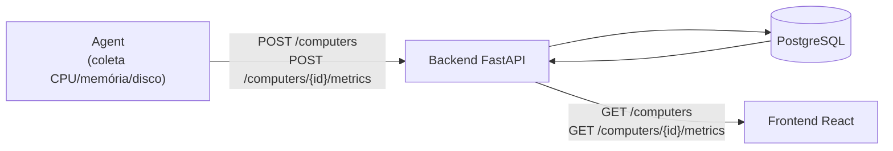

# Fluxo do sistema

Fluxo atual de dados entre as três aplicações do Sentinel.

- **Agent**: se registra uma vez e, a partir daí, só envia métricas (ingestão).
- **Backend**: persiste tudo em PostgreSQL e é a única aplicação que fala com o banco.
- **Frontend**: só consulta (leitura), nunca escreve diretamente no backend nesta fase.

## Diagramas por aplicação

Este arquivo mostra a visão geral. O fluxo interno de cada aplicação está em arquivos `.mmd` próprios (renderizados nativamente pelo GitHub, e reutilizáveis em outras ferramentas):

- [`architecture.mmd`](architecture.mmd) — mesmo diagrama acima, como fonte independente.
- [`backend-flow.mmd`](backend-flow.mmd) — camadas do backend (router → schema → service → repository → model → banco) e tratamento de exceções.
- [`agent-flow.mmd`](agent-flow.mmd) — registro com retry, loop de coleta/envio e tratamento de falhas do Agent.
- [`frontend-flow.mmd`](frontend-flow.mmd) — rota → página → hooks (com polling) → API.
